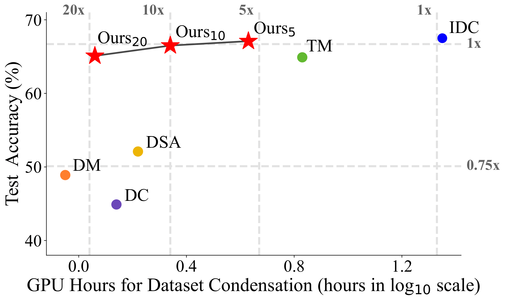

# Accelerating Dataset Distillation via Model Augmentation

Official implementation of  ["Accelerating Dataset Distillation via Model Augmentation"](https://arxiv.org/abs/2212.06152)

## Abstract

Dataset Distillation (DD), a newly emerging field, aims at generating much smaller but efficient synthetic training datasets from large ones. Existing DD methods based on gradient matching achieve leading performance; however, they are extremely computationally intensive as they require continuously optimizing a dataset among thousands of randomly initialized models. In this paper, we assume that training the synthetic data with diverse models leads to better generalization performance. Thus we propose two model augmentation techniques, i.e. using early-stage models and parameter perturbation to learn an informative synthetic set with significantly reduced training cost. Extensive experiments demonstrate that our method achieves up to 20x speedup and comparable performance on par with state-of-the-art methods.

<div align=center><center></center></div>

<div align=center><center>Performance of condensed dataset v.s. GPU hours.</center></div>

## Datasets

- CIFAR-10
- CIFAR-100
- ImageNet-10
- ImageNet-100

## Experiment Commands

### Pretrain Early-Stage Models on Real Data

Pretrain early-stage models on real data, simply run the following codes:

```
python pretrain.py -d [dataset] --nclass [nclass] -n [network] --pt_from [epoch] --seed [seed] --lr [lr] --aug_type [aug]
```

- ```-d```: training dataset.
- ```--nclass```: the number of classes in training dataset.
- ```-n```: the network of early-stage models. ```-n convnet``` for CIFAR-10 and CIFAR-100, ```-n resnetap``` for ImageNet-10 and ImageNet-100.
- ```--pt_from```: the epochs of pretraining. ```--pt_from 2``` for CIFAR-10 and CIFAR-100, ```--pt_from 10``` for ImageNet-10 and ImageNet-100.
- ```--seed```: the random seed of model and ```--aug_type``` can be selected from color, crop, cutout, flip, scale and rotate and joined with '-', like ```--aug_type color_crop_cutout_flip_scale_rotate```.
- ```--aug_type```: the data augmentation of training.
- You can also modify more hyper-parameters including model number, optimizer, weight decay, etc to increase the diversity of models.

### Optimize Condensed Data

Synthesize condensed data with factor 2 and 10 images per class on CIFAR-100, run the following codes:

```
python condense.py --reproduce -d [dataset] -f [factor] --ipc [ipc] -n [network] --model_path [path] 
```

- ```-d```: training dataset.
- ```-f```: factor. ```-f 2``` for CIFAR-10 and CIFAR-100, ```-f 3``` for ImageNet-10 and ImageNet-100.
- ```--ipc```: number of image per class in distilled dataset.
- ```-n```: the network. ```-n convnet``` for CIFAR-10 and CIFAR-100, ```-n resnetap``` for ImageNet-10 and ImageNet-100.
- ```--model_path```: the path of checkpoints of pretrained early-stage models.
- You can also modify the parameters for other datasets.

[comment]: <> (In ImageNet-100, we can use the following codes:)

[comment]: <> (```)

[comment]: <> (python condense_mp.py --reproduce  -d imagenet --nclass 100 --pt_from 5 -f [factor] --ipc [image/class] --nclass_sub 20 --phase [0,1,2,3,4] --model_num 5)

[comment]: <> (```)

## Citation
```
@article{
DBLP:journals/corr/abs-2212-06152,
author={Lei Zhang and Jie Zhang and Bowen Lei and Subhabrata Mukherjee and Xiang Pan and
        Bo Zhao and Caiwen Ding and Yao Li and Dongkuan Xu},
title={Accelerating Dataset Distillation via Model Augmentation},
journal={CoRR},
volume={abs/2212.06152},
year={2022},
}
```
